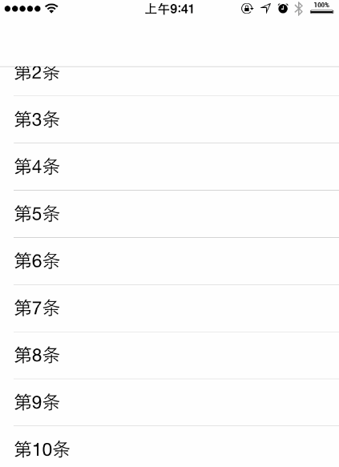

# Animations
一些动画的飞机稿，都是一些单独分离出来的用于测试的子动画，现在统一归类一下。

##1.AnimatedCurveDemo

弯曲弧线的下拉刷新，使用只需要两行代码




###Usage:

```objc

-(void)viewWillAppear:(BOOL)animated{
    [super viewWillAppear:animated];

    KYPullToCurveVeiw *headerView = [[KYPullToCurveVeiw alloc]initWithAssociatedScrollView:self.tableView withNavigationBar:YES];
    
    
    __weak KYPullToCurveVeiw *weakHeaderView = headerView;
    
    [headerView triggerPulling];
    
    [headerView addRefreshingBlock:^{
        
        //具体的操作
        //...
        
        double delayInSeconds = 2.0;
        dispatch_time_t popTime = dispatch_time(DISPATCH_TIME_NOW, delayInSeconds * NSEC_PER_SEC);
        dispatch_after(popTime, dispatch_get_main_queue(), ^(void){
            
            [weakHeaderView stopRefreshing];
            
        });
        
    }];
    
    
    KYPullToCurveVeiw_footer *footerView = [[KYPullToCurveVeiw_footer alloc]initWithAssociatedScrollView:self.tableView withNavigationBar:YES];
    
    __weak KYPullToCurveVeiw_footer *weakFooterView= footerView;
    
    [footerView addRefreshingBlock:^{
        
        //具体的操作
        //...
        
        double delayInSeconds = 2.0;
        dispatch_time_t popTime = dispatch_time(DISPATCH_TIME_NOW, delayInSeconds * NSEC_PER_SEC);
        dispatch_after(popTime, dispatch_get_main_queue(), ^(void){
            
            [weakFooterView stopRefreshing];
            
        });
        
        
    }];

    
}


```
