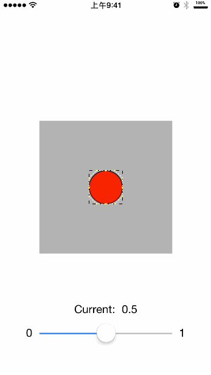
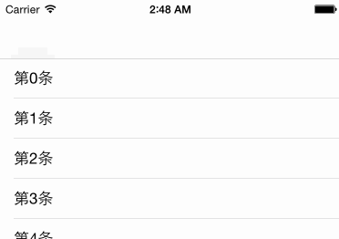
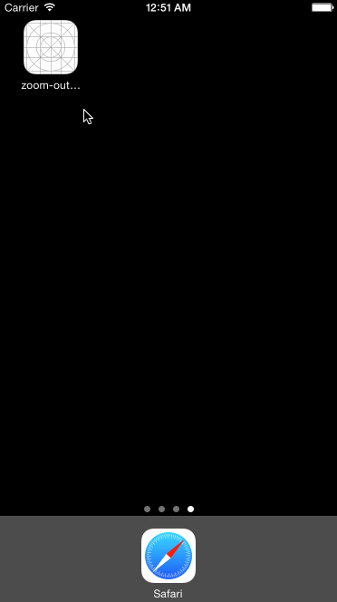

# Animations

A few of test animations.

一些动画的飞机稿。

# 1. AnimatedCurveDemo


###Usage:

```objc

-(void)viewWillAppear:(BOOL)animated{
    [super viewWillAppear:animated];

    //下拉刷新 Pull down to refresh
    KYPullToCurveVeiw *headerView = [[KYPullToCurveVeiw alloc]initWithAssociatedScrollView:self.tableView withNavigationBar:YES];
    __weak KYPullToCurveVeiw *weakHeaderView = headerView;
    [headerView triggerPulling];
    [headerView addRefreshingBlock:^{
        
        //Your detail action...
        //...
        double delayInSeconds = 2.0;
        dispatch_time_t popTime = dispatch_time(DISPATCH_TIME_NOW, delayInSeconds * NSEC_PER_SEC);
        dispatch_after(popTime, dispatch_get_main_queue(), ^(void){
            
            [weakHeaderView stopRefreshing];
            
        });
        
    }];
    
    
    // Pull up to refresh
    KYPullToCurveVeiw_footer *footerView = [[KYPullToCurveVeiw_footer alloc]initWithAssociatedScrollView:self.tableView withNavigationBar:YES];
    __weak KYPullToCurveVeiw_footer *weakFooterView= footerView;
    [footerView addRefreshingBlock:^{
        //Your detail action...
        //...
        double delayInSeconds = 2.0;
        dispatch_time_t popTime = dispatch_time(DISPATCH_TIME_NOW, delayInSeconds * NSEC_PER_SEC);
        dispatch_after(popTime, dispatch_get_main_queue(), ^(void){
            
            [weakFooterView stopRefreshing];
            
        });
        
    }];

    
}


```

---

---


# 2. AnimatedCircleDemo



A transformable layer with progress control. 

---

---

# 3. NavbarTitleWithFadeAnimation

Just set two values: `initialOffset` which is the distance of title between navbar  & `targetHeight` which means the scroll distance to target cell. 

And then,the code will automaticly compute the translation value and alpha value.




# 4.zoom-out splash view



